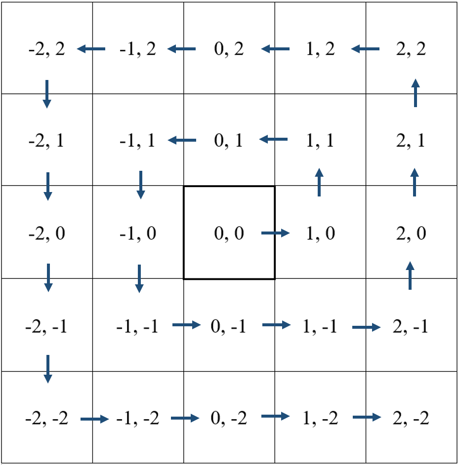

## General Information

SkyClaims islands uses a standardized layout.
Only one island will be generated per [Minecraft Region](http://minecraft.gamepedia.com/Region_file_format).
This approach has the benefit of providing a lot of flexibility for changing Island sizes without ever requiring resetting because of incompatible configuration changes.
The max island size due to this design is 512 x 512 (32 x 32 chunks) minus half of the blocks you want to reserve as a division between adjacent islands.
Isolating each island to its own region also help simplify rollbacks and minimizes the effects of most chunk corruption to one island.

## Island Placement

Island placement is done as an outward spiral from region 0,0.
This creates an effect where all the islands circle around the spawn in an awesome neighborhood!
Regions with deleted islands will be reutilized by the island generator upon the next island creation.

At time of setup, you will be able to reserve a square number of regions for a spawn/admin area.
This area is automatically claimed with an admin claim after the first island is created.
If you choose utilize a separate dimension for this purpose, region 0,0 (_block x,z: 0,0 - 511,511_) will still be reserved for vanilla world spawn!
Anything built outside the designated spawn regions or player's islands may be cleared by SkyClaims' island generation routine.

### Spiral Layout

